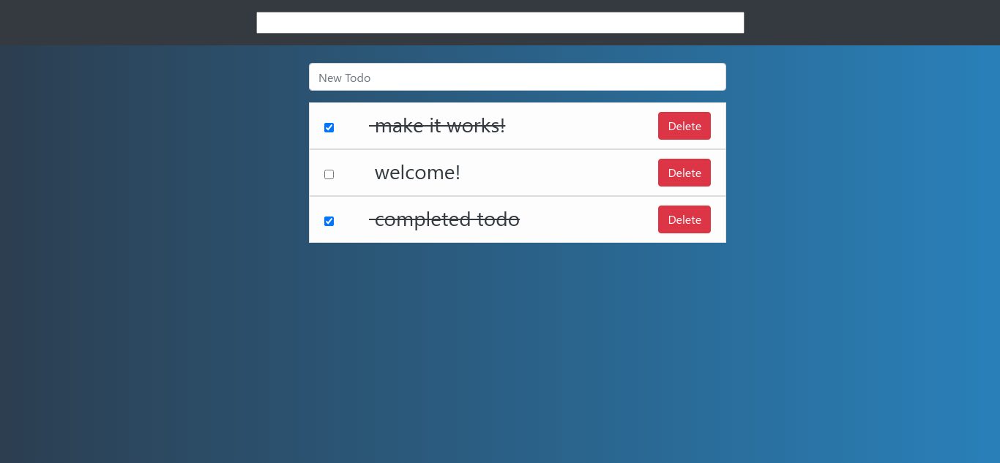
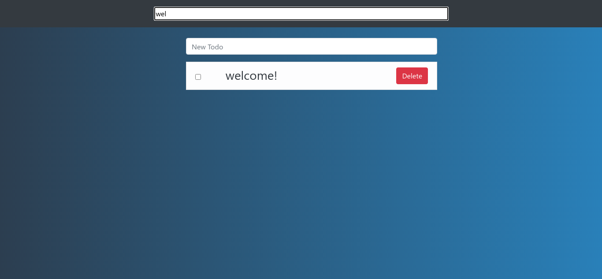

# Crud with Express, MongoDB and VueJS (Stack MEVN)

This is a very simple application using the javascript MEVN Stack. 

You can add, delete and search for todos in a database todos and mark it when you complete the todos, it's very simple but is a way to start with this stack.
___
## How to make it works ?

You must follow the next steps:

1. First of all you need to enter in the api folder and type in your terminal one of the following commnads:

```bash
$ npm i
$ npm install
```

That will install all the dependencies the project needs to work.

1. go in the src folder. then in the database folder and open the conn.ts file and change the env variable for the mongodb uri `process.env.DB_URI`.

2. execute the command `$ npm run start:build` it will start the server

3. Go to the frontend folder and just read the README.md that is in that folder.

## Pictures


___
